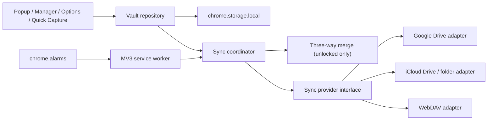

# SafeMarks 可选云同步设计

状态：macOS/iCloud Drive MVP 已实现；Google Drive、WebDAV 与高级历史管理待实现  
目标版本：Phase 5.1  
最后更新：2026-07-19

## 当前实现范围（v1.2.0）

已实现：

- macOS iCloud Drive / Dropbox / OneDrive 等本地云盘同步文件夹；
- 设置页目录选择、重新授权、手动同步、断开和新设备恢复；
- 保存后 30 秒去抖同步、解锁检查和 15 分钟兜底检查；
- 保险库 V2、可记录迭代次数的 PBKDF2、`updatedAt`、删除墓碑；
- 不可变密文修订、修订图 head 计算、双端离线三方合并；
- 并发编辑时保留“同步冲突副本”，不静默覆盖；
- 主密码在另一设备修改后，旧设备引导先下载本地加密备份，再用新密码恢复云端版本。

尚未实现：

- Google Drive API 和 WebDAV 适配器；
- 逐字段/逐条目的交互式冲突选择页；
- 远端修订自动清理与历史恢复 UI；
- 按设备性能动态校准 PBKDF2（当前 V2 固定记录 210,000 次，V1 保持 100,000 次兼容）。

## 1. 结论

SafeMarks 的云同步应当是一个**可选、端到端加密、本地优先**的能力：

- SafeMarks 不建立自己的账号体系，也不建设保存用户书签的后端。
- macOS 首选 iCloud Drive 同步文件夹；同时提供 Google Drive API，第二阶段增加 WebDAV。
- 云端只保存加密快照和同步所必需的少量非内容元数据。
- 所有保存先在本地完成，网络同步异步执行，离线时不影响收藏和管理。
- 多端分叉后只在本地解锁状态下合并；不使用“最后上传者覆盖全部数据”。
- 用户明确授权的同步文件夹是一等提供方，可放在 iCloud Drive、Dropbox、OneDrive 或其他系统云盘目录中；普通下载文件仍只是备份。

这不是把 `chrome.storage.local` 替换成 `chrome.storage.sync`。当前保险库是整包 AES-GCM 密文，每次修改都会重加密完整书签数组；Chrome Sync 的存储模型也无法解决密文整包的并发覆盖问题。

## 2. 产品边界

### 2.1 用户价值

1. 在另一台 Chrome 设备上选择同一个 iCloud Drive/云盘目录，或连接同一个云账号并输入主密码，即可恢复书签。
2. 日常修改自动同步，不需要反复导出和导入备份。
3. 离线使用、手动锁定、自动锁定等现有行为不改变。
4. 云服务商无法读取书签标题、URL、备注、目录或标签。

### 2.2 非目标

- 不提供 SafeMarks 自有账号、找回主密码或托管恢复密钥。
- 不同步锁定状态、会话密钥、搜索历史、最近目录和语言偏好。
- 不在锁定状态上传明文 Quick Capture 队列。
- 首版不做实时协作，也不保证秒级同步。
- 首版不在不同主密码、不同 `vaultId` 的两个独立保险库之间自动合并。

### 2.3 提供方顺序

| 阶段 | 提供方 | 定位 | 原因 |
| --- | --- | --- | --- |
| MVP | iCloud Drive / 同步文件夹 | macOS 默认同步 | 不需要 Google 账号；用户在系统选择器中明确授权 SafeMarks 文件夹；同样兼容 Dropbox、OneDrive 等本地云盘目录 |
| MVP | Google Drive `appDataFolder` | 跨平台托管同步 | 用户连接成本低；应用只能访问自己的隐藏数据目录；SafeMarks 无需自建账号 |
| V1.1 | WebDAV | 高级同步 | 适合 NAS、自托管和隐私敏感用户；按用户填写的源站请求可选主机权限 |
| 保留现状 | 普通下载文件 | 备份/恢复 | 没有持续目录授权，只适合手动归档 |

macOS 上由用户在设置页点击“选择同步文件夹”，通过 `showDirectoryPicker({ mode: "readwrite" })` 选择 iCloud Drive 中的 SafeMarks 目录。目录句柄存入 IndexedDB，后续在权限仍有效时复用。文件选择器只能由用户手势打开；如果 Chrome 或 macOS 撤销权限，自动同步暂停并显示“重新授权文件夹”，不能由后台静默弹窗。

Google Drive 使用 `chrome.identity` 获取 OAuth 令牌，并只申请 `drive.appdata` 范围。WebDAV 默认只允许 HTTPS；连接时再申请目标源站的 `optional_host_permissions`，不在安装时申请全网访问。

参考：

- [Chrome identity API](https://developer.chrome.com/docs/extensions/reference/api/identity)
- [Chrome 扩展权限与可选主机权限](https://developer.chrome.com/docs/extensions/develop/concepts/declare-permissions)
- [Google Drive 应用专用数据目录](https://developers.google.com/workspace/drive/api/guides/appdata)
- [Chrome File System Access API](https://developer.chrome.com/docs/capabilities/web-apis/file-system-access)
- [Chrome alarms API](https://developer.chrome.com/docs/extensions/reference/api/alarms)

### 2.4 macOS / iCloud Drive 行为边界

- SafeMarks 不读取用户的整个 iCloud Drive，只能访问用户在系统选择器里授权的目录。
- 推荐用户创建 `iCloud Drive/SafeMarks` 专用目录；SafeMarks 不依赖或展示 macOS 的内部 iCloud 路径。
- SafeMarks 写入的是密文修订文件，iCloud Drive 负责跨 Mac 传输；Apple 仍可看到文件大小、修改时间和随机文件名，但看不到书签内容。
- Chrome 关闭时不会产生新的本地收藏修改，因此不要求额外安装 macOS 常驻程序；远端变化在 Chrome 下次启动或解锁时读取。
- 自动检查属于尽力而为。目录权限若不再是 `granted`，必须由用户点击重新授权后继续。
- 首次实现必须在打包后的 Chrome 扩展中验证：目录句柄写入 IndexedDB、浏览器重启后读取、service worker 使用句柄和权限恢复。任一项不可靠时，该环境降级为“点击同步”，不能宣称后台自动同步。

## 3. 安全模型

### 3.1 云端可以看到什么

云服务商可以看到：

- SafeMarks 创建了文件；
- 文件大小、上传时间和修订数量；
- 随机的保险库 ID、设备 ID、修订 ID 及父修订关系。

云服务商不能看到：

- 书签 URL、标题、备注、标签和目录；
- 主密码和会话密钥；
- 自动锁定时间、密码提示、搜索历史和 Quick Capture 暂存内容。

### 3.2 威胁边界

- 主密码仍是唯一解密入口，SafeMarks 无法找回。
- 云端密文可以被离线猜测主密码，因此 V2 已把 PBKDF2 迭代次数写入记录并把新保险库提高到 210,000 次。后续仍应增加按设备性能校准和旧 V1 保险库的显式重加密升级流程；当前 V1 迁移为避免破坏原密码兼容，会保留原 100,000 次参数。
- AES-GCM 保护密文完整性。外层修订头只用于远端定位，同一组字段会复制到加密负载内；解锁后必须逐字段比对，任何不一致都按远端损坏处理。稳定的格式版本和 `vaultId` 作为 AAD，避免密文被移到另一种格式或另一保险库下使用。
- 本地保存最后确认的远端 head。远端回退到旧修订时显示“云端历史疑似回退”，不静默覆盖本地。
- 已解锁且被攻陷的浏览器、恶意扩展或系统级恶意软件仍可能读取数据；云同步不扩大现有解锁态的安全承诺。

### 3.3 不上传的本地数据

| 数据 | 原因 |
| --- | --- |
| `safeMarksSession` / `encodedKey` | 会话密钥绝不离开设备 |
| `pendingQuickCaptures` | 锁定态暂存为明文，只能在本机解锁并写入保险库后再同步 |
| `folderCatalog` | 可从已解密书签重新推导 |
| `recentFolderPaths`、搜索历史 | 设备级使用痕迹，没有跨端价值 |
| 语言、自动锁定、备份提醒 | 设备级偏好 |
| `passwordHint` | 避免把可能泄露密码信息的提示上传；以后可单独提供明确的选择项 |

## 4. 数据模型

当前 `version: 1` 的 `vault` 解密后直接得到书签数组，书签只有 `createdAt`，也没有删除墓碑。它无法区分“另一端删除了条目”和“这一端还没见过条目”，也无法可靠合并并发编辑。

启用同步前引入保险库 V2：

```js
{
  version: 2,
  vaultId: "vault_<random>",
  kdf: {
    name: "PBKDF2",
    hash: "SHA-256",
    iterations: 210000
  },
  salt: "<base64>",
  auth: { iv: "<base64>", ciphertext: "<base64>" },
  vault: { iv: "<base64>", ciphertext: "<base64>" },
  settings: { /* 仅本地 */ },
  meta: { /* 仅本地派生 */ }
}
```

`vault` 解密后的 V2 负载：

```js
{
  schemaVersion: 2,
  bookmarks: [
    {
      id: "bm_...",
      url: "https://example.com",
      title: "Example",
      note: "",
      folderPath: "Work",
      tags: [],
      createdAt: 1750000000000,
      updatedAt: 1750000000000
    }
  ],
  tombstones: [
    {
      id: "bm_...",
      deletedAt: 1750001000000
    }
  ]
}
```

设计约束：

- `updatedAt` 只用于判断条目是否变化，不单独决定冲突胜负，避免设备时钟错误导致数据丢失。
- 删除写入墓碑，不立即物理移除同步信息。
- 墓碑至少保留 90 天；只有所有已知设备都越过包含该墓碑的修订，或用户手动清理历史时才压缩。
- V1 → V2 迁移只在用户成功解锁后发生；为每条旧书签设置 `updatedAt = createdAt`，生成 `vaultId`，然后先保存本地加密备份，再写入 V2。
- V2 代码必须继续读取 V1；迁移完成前不允许启用云同步。

## 5. 云端文件格式

远端采用“不可变修订 + head 清单”，避免上传中断损坏唯一副本：

```text
SafeMarks/
  manifest.json            # API 提供方的权威 head；文件夹提供方仅作缓存提示
  revisions/
    <revisionId>.json
```

`manifest.json` 不含书签内容：

```js
{
  format: "safemarks-sync-manifest",
  formatVersion: 1,
  vaultId: "vault_<random>",
  headRevisionIds: ["rev_<random>"],
  updatedAt: 1750002000000
}
```

修订文件：

```js
{
  format: "safemarks-sync-revision",
  formatVersion: 1,
  vaultId: "vault_<random>",
  revisionId: "rev_<random>",
  parentRevisionIds: ["rev_<random>"], // 首个修订为空数组，合并修订可有多个父节点
  deviceId: "device_<random>",
  committedAt: 1750002000000,
  crypto: {
    vaultVersion: 2,
    kdf: { /* 解锁所需的公开参数 */ },
    auth: { /* AES-GCM blob */ },
    snapshot: {
      iv: "<base64>",
      ciphertext: "<base64>"
    }
  }
}
```

`snapshot` 解密后才得到可信的完整内容：

```js
{
  vaultId: "vault_<random>",
  revisionId: "rev_<random>",
  parentRevisionIds: ["rev_<random>"],
  deviceId: "device_<random>",
  committedAt: 1750002000000,
  payload: { /* 第 4 节的 V2 负载 */ }
}
```

同步提交在保险库仍解锁时生成并缓存完整的 `pendingRevision`，所以之后即使 popup 已关闭或保险库已锁定，service worker 也只需搬运已生成的密文，不需要接触会话密钥。外层头不能单独作为覆盖本地数据的依据；远端快照必须在解锁、验证内外字段并完成合并后才能成为本地当前版本。

`settings`、`meta` 和密码提示不写入云端。新设备下载后使用本地默认设置；首次解锁后重新计算书签数量和目录索引。

Google Drive 和 WebDAV 的上传顺序：

1. 上传新的不可变修订文件。
2. 使用提供方的版本令牌做 compare-and-swap 更新 `manifest.json`。
3. 重新读取 head 验证提交结果。
4. 若 head 已被另一设备推进，不覆盖；进入拉取、合并、再提交流程。
5. 保留最近 10 个成功修订和至少 30 天历史，清理无引用的失败上传文件。

WebDAV 可把版本令牌映射为 ETag 条件写，Drive 适配器映射为其文件版本/条件请求能力。业务层不得依赖某一家 API 的字段。

iCloud Drive/同步文件夹没有可靠的跨设备 compare-and-swap，因此不能把 `manifest.json` 当成唯一事实源：

1. 每台设备只创建全局唯一命名的不可变修订文件，不覆盖其他设备文件。
2. 扫描 `revisions/`，根据已验证的父修订关系重建 DAG。
3. 一个 head 表示可快进；多个 head 表示发生分叉，解锁后三方合并并写入一个同时收敛这些 head 的合并修订。
4. `manifest.json` 只用于加速扫描；它丢失、延迟或出现 iCloud 冲突副本都不能造成数据丢失。
5. 清理历史前至少连续两次扫描结果一致，并保留最近 30 天修订。

因此提供方接口需要声明能力：`conditionalWrite: true/false`。API 提供方走条件更新 head；文件夹提供方走“列出不可变修订并计算 head”。

## 6. 本地同步状态

新增独立的 `syncState`，不混进保险库记录：

```js
{
  enabled: true,
  provider: "icloud-folder | google-drive | webdav",
  deviceId: "device_<random>",
  vaultId: "vault_<random>",
  lastSyncedRevisionId: "rev_<random>",
  lastSyncedAt: 1750002000000,
  localDirty: false,
  pendingRevisionId: null,
  pendingReason: null,
  schedule: "on-change",
  lastError: null
}
```

另保存 `syncBaseRecord`：最后一次成功同步的**密文**保险库快照；本地提交后还会保存等待上传的**密文** `pendingRevision`。发生分叉时，解锁后分别解密 base、本地和远端，执行三方合并。不要把 base、pending 或远端暂存以明文缓存到 `chrome.storage.local`。

提供方授权状态与同步状态分开。断开云同步时默认只撤销授权并保留本地保险库；删除云端副本必须是第二个明确操作。

## 7. 同步流程

### 7.1 本地优先写入

所有会修改保险库的入口最终必须走同一个 `commitVaultMutation()`，替代各页面直接调用 `saveVaultRecord()`：

```text
UI / Quick Capture
  -> commitVaultMutation
  -> 本地加密并保存
  -> 标记 localDirty
  -> 返回 UI 成功
  -> 后台去抖后同步
```

网络失败不回滚本地保存。连续修改按 Chrome alarms 允许的最短生产间隔（当前 30 秒）去抖合并成一次上传。

### 7.2 触发时机

- 用户解锁后：立即检查远端 head。
- 本地修改后：30 秒去抖同步。
- 浏览器启动和网络恢复后：检查一次。
- 自动同步启用时：用现有 `chrome.alarms` 做 15 分钟兜底检查。
- 用户点击“立即同步”：立刻执行。
- iCloud Drive/同步文件夹权限失效后：停止自动检查，等待用户从设置页重新授权。

MV3 service worker 和 alarms 都是尽力而为，系统休眠时不会保证准点执行。因此界面文案使用“自动检查”，不承诺固定时刻完成。

### 7.3 锁定状态

锁定状态可以读取远端清单和搬运完整密文，但不能解密合并：

- 远端未变、本地有已在解锁态生成的 `pendingRevision`：可直接上传该密文修订。
- 本地未变、远端是当前 head 的后继：只下载并暂存远端密文，解锁验证后再应用，不直接替换当前本地保险库。
- 两边都变：设置 `pendingReason = "unlock-to-merge"`，不覆盖任何一边，提示“解锁后完成合并”。
- Quick Capture 队列仍只留本机；解锁写入保险库后才进入正常同步。

### 7.4 三方合并

输入为 `base`、`local`、`remote` 三个已解密 V2 负载，按书签 ID 合并：

| 情况 | 结果 |
| --- | --- |
| 仅一端新增 | 保留新增 |
| 仅一端相对 base 修改 | 采用修改 |
| 两端修改后内容相同 | 保留一份 |
| 两端修改且内容不同 | 生成冲突，用户选择本地/云端/两份都保留 |
| 一端删除，另一端未改 | 保留删除墓碑 |
| 一端删除，另一端修改 | 生成冲突，用户选择删除或恢复修改版 |
| 两端删除 | 保留较新的墓碑时间，但不依赖它决定业务内容 |

冲突解决完成前，本地和远端原修订都保留。选择“两份都保留”时，云端版本生成新书签 ID，并在标题后临时标注“冲突副本”；用户可立即重命名。

不同 `vaultId` 不执行上述合并。连接时如果云端已有另一个保险库，必须让用户选择：

1. 使用云端保险库（先导出当前本地加密备份）；
2. 使用本地保险库覆盖云端（保留云端历史）；
3. 取消连接。

## 8. 架构改造



建议新增模块：

```text
src/core/
  vault-repository.js      # 统一保险库提交入口
  vault-migration.js       # V1 -> V2
  sync-schema.js           # 清单、修订、syncState 校验
  sync-merge.js            # 纯函数三方合并
  sync-coordinator.js      # 状态机、重试、去抖、互斥
  sync-history.js          # 本地 base 与远端历史保留策略
src/providers/
  sync-provider.js         # 接口契约
  local-folder.js          # iCloud Drive / 系统云盘目录
  google-drive.js          # MVP
  webdav.js                # V1.1
src/shared/
  sync-status.js           # 多页面共享状态呈现
```

提供方接口：

```js
{
  connect(),
  disconnect(),
  getStatus(),
  getCapabilities(),
  readManifest(),
  writeManifest(manifest, expectedVersionToken),
  readRevision(revisionId),
  writeRevision(revision),
  listRevisions(),
  deleteRevision(revisionId),
  persistConnectionHandle() // 文件夹提供方使用 IndexedDB，不写入普通 JSON storage
}
```

`sync-coordinator` 必须用一个存储锁或单飞 Promise 串行化任务，防止 popup、manager、alarm 和 service worker 同时开始同步。

## 9. 状态机与错误处理

对用户展示的状态限制为以下几类：

| 状态 | 文案 | 行为 |
| --- | --- | --- |
| `off` | 未启用云同步 | 本地功能不变 |
| `connecting` | 正在连接 Google Drive | 等待授权 |
| `folder-permission` | 需要重新授权同步文件夹 | 用户点击后打开系统选择器 |
| `synced` | 已同步 · 刚刚 | 无操作 |
| `local-dirty` | 已保存在本地，等待同步 | 后台重试 |
| `offline` | 当前离线，稍后自动重试 | 不打断保存 |
| `needs-unlock` | 解锁后完成多端合并 | 引导解锁 |
| `conflict` | 有 N 项需要选择 | 打开冲突处理页 |
| `auth-required` | 云盘连接已失效 | 重新授权 |
| `error` | 同步失败，本地数据安全 | 提供重试和错误详情 |

重试使用指数退避并加入随机抖动；认证失败不循环重试；配额/限流错误显示下一次重试时间。所有错误都不得清空 `localDirty`。

## 10. 交互设计

设置页新增“云同步（可选）”卡片：

```text
云同步（可选）
书签先在本地加密，再把密文保存到你的云盘。
SafeMarks 和云服务商都无法读取书签内容。

[使用 iCloud Drive / 同步文件夹]  [连接 Google Drive]

连接后：
iCloud Drive/SafeMarks    已授权
状态                      已同步 · 2 分钟前
自动检查                  保存后自动同步
[立即同步] [查看同步历史] [断开连接]
```

交互原则：

- 首次连接前展示“上传什么 / 不上传什么 / 忘记密码无法恢复”。
- macOS 上把“iCloud Drive / 同步文件夹”放在第一位；其他桌面系统显示“同步文件夹”。
- 选择文件夹时提示只授权一个专用 SafeMarks 目录，不要选择整个 iCloud Drive 根目录。
- popup 只显示轻量状态图标；详细配置和错误处理留在设置页。
- 冲突处理使用 manager 风格的全页界面，不塞进 popup。
- 断开连接不删除本地或云端数据；“删除云端 SafeMarks 数据”单独放在危险操作区并二次确认。
- 远端首次恢复覆盖本地前，自动下载或导出一份当前本地加密备份。

## 11. 隐私与商店发布影响

功能发布前必须同步更新：

- `README.md`：从“无云端”改为“核心功能本地运行，可选端到端加密云同步”。
- `docs/privacy-policy.md`：披露用户主动连接的云提供方、传输的密文和可见元数据、授权撤销与删除方式。
- `docs/store-submission.md`：更新远程服务、数据使用声明和新增权限理由。
- `manifest.json`：Google Drive 需要 identity/OAuth 配置；WebDAV 使用运行时可选主机权限。
- iCloud Drive/同步文件夹不新增远程主机权限；目录访问由系统选择器逐目录授权，句柄保存在 IndexedDB。
- 商店截图和介绍：避免继续使用绝对的“无云端”表述，改为“无 SafeMarks 账号 / 无自建云端 / 云同步可选”。

## 12. 验收标准

### 12.1 核心正确性

- 两台模拟设备分别离线新增书签，重新联网后两条都存在。
- 两台 Mac 同时向同一个 iCloud Drive 目录写入不同 head，文件全部保留，解锁后收敛为一个合并修订。
- iCloud 生成 `manifest` 冲突副本或延迟同步时，重新扫描不可变修订仍能恢复正确 head。
- 目录授权被撤销或浏览器重启后权限变为 `prompt` 时，不丢本地修改，并明确要求重新授权。
- 两端编辑同一条目的不同内容时不静默覆盖，必须出现冲突选择。
- 一端删除、另一端离线编辑同一条目时不丢数据，必须出现冲突选择。
- 上传在写入修订后、更新 manifest 前中断，旧 head 仍可正常恢复。
- 锁定状态发生分叉时不覆盖任何一端，解锁后可合并。
- 修改主密码后，旧设备明确要求输入新密码，不显示“数据损坏”。
- Quick Capture 明文永不出现在同步请求体或远端测试夹具中。

### 12.2 安全与隐私

- 网络夹具中搜索任意书签标题、URL、备注、标签均无匹配。
- 云端文件不包含 `encodedKey`、密码提示、搜索历史或自动锁定设置。
- revision 头部被篡改时，解锁后的内外字段校验失败；格式或 `vaultId` 被替换时 AES-GCM AAD 校验失败。
- 未连接云同步的用户不会收到新增远程主机权限提示，也不会发起网络请求。
- 删除云端数据、断开授权、保留本地数据三个操作分别可验证。

### 12.3 回归

- V1 保险库仍可创建、解锁、导出和导入。
- V1 → V2 迁移失败时保留原记录且可继续解锁。
- popup、manager、options、onboarding 和 Quick Capture 的现有保存流程全部通过统一 repository。
- `npm test` 覆盖迁移、同步 schema、合并矩阵、状态机、提供方契约和故障注入。

## 13. 实施切片

1. **数据地基**：V2 schema、`updatedAt`、墓碑、KDF 参数化、V1 迁移和测试。
2. **统一写入口**：引入 vault repository，替换所有页面直接保存路径，不接云端。
3. **同步内核**：revision/manifest、base 快照、三方合并、状态机和 mock provider。
4. **macOS/iCloud Drive MVP**：目录选择器、IndexedDB 句柄、不可变修订扫描、权限恢复和双 Mac 验证。
5. **Google Drive MVP**：OAuth、`appDataFolder`、设置页、手动同步、恢复。
6. **自动同步**：保存后去抖、启动/解锁检查、alarm 兜底、离线重试。
7. **冲突与历史**：冲突处理页、历史恢复、远端清理。
8. **WebDAV**：可选源站权限、HTTPS 校验、凭据策略、ETag 条件写。
9. **发布合规**：隐私政策、商店声明、权限说明、端到端双设备测试。

前 3 个切片应先在完全本地的 mock provider 上通过，再接真实云服务。这样可以先证明数据模型和冲突安全，再处理 OAuth 与网络差异。
